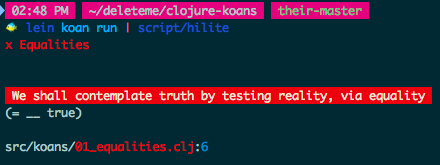
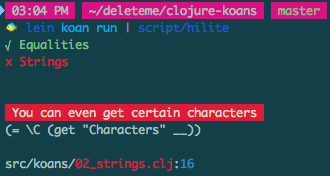
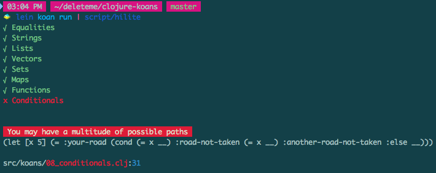

Walkthrough the Clojure koans
=============================

I'm going to walk through how I did some of the [Clojure koans](http://clojurekoans.com/)
since I'm pretty new at it and can suggest strategies and point out the contexts
that allow some things to make sense.

I made a hilite script that will make the output easier to read and understand,
you can get it like this:

```sh
# from the clojure koans root directory
hilite_url="https://raw.githubusercontent.com/JoshCheek/clojure-koans/f96504c839c59d09f0e1109de602aa407dec87cc/script/hilite"
curl -L "$hilite_url" > script/hilite
chmod +x script/hilite
```

And you can run the koans with it like this:

```sh
clear # this is to move your prompt to the top of the screen
lein koans run | script/hilite
```

This is the first strategy: **build yourself tools to improve your feedback and address your pain.**


How koans work `(= __ true)`
---------------------------



So, this set of koan's name is "Equalities", which means it's probably a bunch of info on how to tell whether two values (or whatever they call their version of things that can be referenced with a variable). The koan says "we shall contemplate truth by testing reality via equality" and it asserts `(= __ true)`.

This is a general koan pattern, **underscores** are a method or function or something that look like a blank for you to fill in, while still being valid code.

At the bottom of the hilite script it tells us the filename this is from, and the
line number that this test is on, so open an editor and go there.

koans like to start off simple, this is just showing us how to use the thing, we're supposed to assert that `true` is equal to `true`, the "hello world" of koans.

When you save the file, you should see the koans rerun the tests and the failure changes to "To understand reality, we must compare our expectations against reality". Koans probably come from China or something, they've got that zen style of wording.


What is lisp `(= 2 (+ 1 1))`
----------------------------

```clojure
"To understand reality, we must compare our expectations against reality"
(= __ (+ 1 1))
```

Okay, so Clojure is a type of programming language called a [lisp](https://en.wikipedia.org/wiki/Lisp_(programming_language)). It's called this because its ideas revolve around "<strong>LIS</strong>t <strong>P</strong>rocessing". Lists are also called "linked lists", and are collections similar to arrays ([more info](https://github.com/turingschool/waypoints/blob/579a10ece2881b0df14b56e82d43e5e028cc1c63/waypoints/linked_lists.md)). The syntax for making a list is to use parentheses, and delimit the elements with whitespace, NOT a comma. The default behaviour is to assume the first element in the list is a function (aka method / procedure / proc / lambda / subroutine), and the rest of the elements are arguments. So, in `(+ 1 1)` the `+` is a fn, the `1`s are arguments. When a lisp evaluates such a structure, it calls the function and gives it the arguments, then replaces it with the returned value. So, the function `+` receives the two values `1` and `1`, and returns `2`. This means we have `(= __ 2)`. Note that this is the same pattern, here the `=` is our function. We update the blank to say `2`, and it passes.


Descriptions and the REPL `(= __ (= 2 2/1))`
--------------------------------------------

This one was hard for my brain to parse, but I didn't have to parse it because the description was _"Some things may appear different, but be the same"_, so they're telling us that the two things being compared for equality are equal. We fill in `true` and it passes. Now that we know the answer, we can look at the problem again to understand why, and we see that paying attention to whitespace, `2` is the first argument, and `2/1` is the second. Two divided by one is two, so yes, they are equal.

The interesting thing here is that this violates our expectations, it did not put the function, `/` out front. In another terminal, we can launch a repl (interactive Clojure session) with `lein repl` and we try:

```clojure
; first we try 2/1 by itself to see if it is a value, it is
koan-engine.runner=> 2/1
2

; what if it didn't come out to a whole number?
koan-engine.runner=> 3/2
3/2

; wtf is that?
koan-engine.runner=> (type 3/2)
clojure.lang.Ratio

; what if we do it the normal way?
koan-engine.runner=> (/ 3 2)
3/2

; can we do it with other functions?
koan-engine.runner=> 2+1
NumberFormatException Invalid number: 2+1

; is the whitespace important?
koan-engine.runner=> 2 / 3
2
#object[clojure.core$_SLASH_ 0x7232fdd1 "clojure.core$_SLASH_@7232fdd1"]
3

; interesting, so the parser has a special rule for ratios that lets us use
; this natural syntax when we're working with ratios. Further, we have to be
; attentive to our whitespace or the parser will think it means something different.
```

This illustrates another strategy: extract the problem into an environment where it is easy to experiment and get good feedback. In this case, a REPL.


Quoting and symbols `(= __ (= "hello" :hello 'hello))`
------------------------------------------------------

Okay, the description is "Strings, and keywords, and symbols: oh my!" and we already know what strings are from other languages, but what about the keyword and symbol? I didn't initially know which was which, but the position of the names tells us, the `:hello` is a keyword and `'hello` is a symbol. So why do these things exist? Well, keywords are a feature in quite a few languages, even Ruby has rudimentary support for them now. Their purpose is to let us pass an argument to a function by name rather than position. They could presumably use strings or symbols for this, but that would get ambiguous since those things are often used as data that you might be passing. So probably the keywords exist to disambiguate these situations.

I realized, from having played with other lisps, that the symbol here is not special. That single quote in front of it is a syntactic shorthand for a function named "quote" we can type this into our REPL to see it is true `(= 'abc (quote abc))`. Quote's job is to tell the parser that we want to deviate from the default way of doing things, instead of executing this code, return it to me as data. With the default way, `hello` would go look up a value, it's like escaping. Remember how lists invoke the first argument and pass the rest of the items to it? Quote will similarly say to return that as data rather than evaluating it.

```clojure
koan-engine.runner=> '(+ 1 2)
(+ 1 2)
```

This idea is useful because it lets you modify the list before executing it. It's how people make "macros" aka "special forms", which lets them deviate from the default evaluation rules and construct their own DSL (domain specific language) within lisp. I assume the `ns` statement at the top of the file is a macro, though I can't quite tell, and our `meditations` function is also a macro, it receives all the koans as quoted data, and it modifies them to be run differently.

The word "symbol" here is very intentionally chosen, it comes from a long line of math and philosophy, a symbol is anything you can use to refer to another thing. So your symbol for me is probably the name "Josh". When we think about it this way, it's not very important how its implemented, it's mostly just important how it's used. "Josh" can be written text, it can be a spoken sound, it can be a picture that enters your head when you think of me, these are all symbolic representations of me, and the symbol here is filling in the same purpose. So, `'hello` is a symbol because it's quoted, and if it weren't quoted, it would be `hello`, a name that refers to something that we then go look up.


Character literals `(= \C (get "Characters" __))`
-------------------------------------------------



So, we've moved on to the second set of tests now. We see that "Equalities" are passing and we're now failing on Strings.

This test tells us we can get characters, and we see `(get "Characters" __)`, which probably translates to Ruby like `"Characters"[__]`. But the expectation looks strange, `\C` we can infer it is a character because of the koan name, and we can infer it's the uppercase "C" from "Characters" because that's the only one that seems remotely related to it. So we try the value `0`, because if we assume it works like Ruby or JavaScript, then that's the index of that character. If it didn't work, we would probably try `1` since some languages start counting from `1` instead of `0`.

While this looks strange, it turns out to be very common, Ruby has a syntax for character literals (though they evaluate to Strings as of Ruby 1.9) `?C`, so does the C programming language `'C'` (in the C lang, this evaluates to the ascii number of the letter 'C', which makes sense when you realize that they don't really have strings, they just sort of fake it by writing the character's ascii values adjacent to each other in memory).


Back to the REPL `(= "World" (subs "Hello World" __ __))`
---------------------------------------------------------

Okay, despite the helpful name of "What if you only wanted to get part of a string?", this one messed with me. I did not realize `subs` was a truncation of `substring`, I thought it meant "substitute" and was trying to substitute the unwanted portion of the string with an empty string (ie Ruby's `sub` / `gsub`). But even if you realized this, there's a lot of ways to interpret it that it could go awry. Some languages take arguments of `start-index` and `length`, others take `start-index` and `finish-index`, and within that idea, is it inclusive or exclusive? So we take our example back to the repl and experiment:

```clojure
; choose a sting of "012" so we can easily map the output back to our input
koan-engine.runner=> (subs "012" 1 1)
""

; that got nothing, so it's probably not start-index and length
koan-engine.runner=> (subs "012" 1 2)
"1"

; okay, so it's start-index inclusive and end-index exclusive
koan-engine.runner=> (subs "012" 1 3)
"12"

; lets bring the real problem back in... eff counting, here's a rough guess
koan-engine.runner=> (subs "Hello World" 5 10)
" Worl"

; pretty good guess! we were only one away on both sides
koan-engine.runner=> (subs "Hello World" 6 11)
"World"
```

strategy: we don't need to recreate the whole problem, or even have the same data, we just need it to be real enough to let us experiment easily with the core ideas. People who are fond of unit testing may notice a correlation.


Namespaces `(string/join '(1 2 3))`
----------------------------------

This one is interesting, it's got that same slash that we saw earlier with the ratios. But, I think that's probably a red herring, this is really just a symbol that is not quoted, so it is getting evaluated as a function. The slash is used to namespace the function, this `join` method is defined in the strings library. Another `join` method could exist elsewhere. We can have two functions with the same name because they're stored in different places or spaces, hence we call them "namespaces". Either this is built into the language, or it's just a normal symbol and the slash is a normal character in the symbol and this is just a convention that the community has settled on. I'm banking on the former because the top of the file calls the `ns` function, which surely means "namespace". However, the latter does occur, IIRC, emacs lisp works this way.


Default arguments `(= __ (string/join '(1 2 3)))`
-------------------------------------------------

So the `string/join` is interesting because we first call it with one argument, and then later we call it with an argument. We already know that functions can take variable numbers of arguments, but before they were more like a list of things to apply to, here the meaning of the arguments is different. Presumably Clojure gives them some way to define these as defaults in the same way that Ruby would let us define it like this:

```ruby
 def join(delimiter="", list)
   joined = ""
   list.each { |e| joined << e.to_s << delimiter }
   joined.chomp delimiter
 end

join([1,2,3])        # => "123"
join(", ", [1,2,3])  # => "1, 2, 3"
```


Previous strategies
-------------------

* `(string/split-lines "1\n2\n3")` there's really 2 things that can vary here. The answer is an ordered collection of lines that either have newlines on the end or don't. The other thing is what kind of collection it is, should we do a quoted array or brackets? That's like 4 possibilities, so I just started with the easiest one to type, `["1" "2" "3"]`, and it turned out to be right. If not, I'd have just kept trying until I exhausted all the likely answers. It is interesting here that a list will also pass. Going to the REPL, I discovered that they are considered equal: `(= '(1) [1])`
* `string/last-index-of "hello world, hello" "hello"` the second argument must be a substring of the first, because the example wouldn't make sense otherwise. I counted by hand and got 14, which turned out to be wrong. So I tried 15 and 13, and that was it, I probably started counting from 1 instead of 0.
* `(string/index-of "hello world" "bob")` the description here is "But when something doesn't exist, nothing is found". We could copy it into the REPL to see what it does, or we could reason that it might be `-1` (if inspired by C or JavaScript) or `nil`, which we saw earlier and would map to Ruby. Alternatively, we can notice their clever wordplay, "nothing is found", if we interpret nothing as a value, then it would be saying `nil is found`. In fact, remember back in the first file, they used the word "nothing" there on two different occasions to refer to `nil`, so it seems likely that this is a language pattern they have settled on.
* `(= __ (string/blank? " \n \t  "))` what the `blank?` function should do here is open to interpretation, but the description tells you how they chose to interpret it: "Some strings may be blank even if at first glance they aren't"


Speculation and exploration
---------------------------

So we get to a challenge that says "[Lists] are Clojure seqs (sequences), so they allow access to the first" This is an interesting statement, they are saying that `first` is not written to work with a list, but with some more abstract idea called a sequence. Because the list is a sequence, it gets the `first` function for free. Ideas like this are often called "interfaces" or "protocols". Perhaps this is the reason lists and brackety things (we'll learn later they're called vectors) are equal? How could we check this? Well, we saw in the previous file that there were `string?` and `char?` functions, so maybe there's a `seq?` function.

```clojure
; bingo!
koan-engine.runner=> (seq? '())
true
koan-engine.runner=> (seq? "")
false

; so now we predict that a vector is a seq, also
; and the `=` function checks equality through some sequence operation
koan-engine.runner=> (seq? [])
false

; uhh... hrmmm -.^

; so it doesn't work with first, then?
koan-engine.runner=> (first [12 34])
12

; no, it does, what about other places we've seen lists used?
koan-engine.runner=> (clojure.string/join [12 34])
"1234"
```

Hmmm. A number of possibilities are entering my head, but this investigation does not look like it's going to be fruitful.


Exceptions
----------

```
(= __ (try
        (pop '())
        (catch IllegalStateException e
          "No dice!")))
```

Okay, this is not immediately obvious what's going to happen. The insight is that Clojure is functional, and functional languages are big on returning values from function invocations. This is because that facilitates immutability (if a fn doesn't return a value, then it was either pointless to call or it went out into the world and modified something that we can't see from here). This gives them a certain ability to reason about the function (as well as matching the mathematical use of functions, which is where the idea was born). So, given that, we can assume it returns a value, and there are really only 2 obvious values here, `"No dice!"` and whatever is returned from `pop`.

We can rule the `pop` one out, though, because it's sitting inside of something that looks like a Java / JavaScript `try/catch` block, or a Ruby `rescue` block. This implies that `pop` explodes in the way we're used to from other languages exceptions, handing control flow to the `catch` section instead. So, the answer must be `"No dice!"`


Difference between lists and vectors `  (= __ (conj [111 222] 333))`
--------------------------------------------------------------------

Okay, this was weird at first, `conj` puts the element at the beginning of a list, but at the end of a vector.

```clojure
koan-engine.runner=> (conj '(a b c) 'x)
(x a b c)
koan-engine.runner=> (conj '[a b c] 'x)
[a b c x]
```

So... how come? Keep in mind that this is speculation.

For a list, because each node is a piece of data and a link to the next node, adding an item to the beginning of the list is very inexpensive, it requires creating only one additional node and pointing at the existing list. I don't know how vectors are implemented, but it is probably optimized to allow you to efficiently access an element at any position (often called "random access"). This means we probably think of them more like arrays than like lists, and with the typical implementation of arrays, the place to append is at the end. The is because arrays are usually contiguous sections of memory that are partially filled, adding an item means we go to the first place in memory that doesn't have a value and place a value there and then increment a counter that tracks how many elements are in the array (if there is no more space left, we first get memory for a new array probably twice as large, and then copy the existing items into the new array). While this is definitely not how vectors are implemented (because this algorithm modifies the array) it does inform how we think about them.

So `conj`, which means "conjoin" winds up being "add an item to my collection in the way that is natural for my type of collection". This probably allows certain types of functions to work without needing to know which type of collection you provided to it.


Assume consistency `(subvec [:peanut :butter :and :jelly] 1 3)`
---------------------------------------------------------------

Clojure's creator, Rich Hickey, is famous for "hammock driven development" which means he implemented a bit, sat in his hammock and contemplated, implemented a bit more, etc, and finally released it 2 years later. Very much not my style. But it means that we can probably assume consistency across interfaces.

With that in mind, we've seen this interface before as `subs`. And we are rewarded with a passing koan if we assume that the arguments have the same meanings (starting index, and ending index, exclusive).

At the same time, it's not totally consistent, or we'd have `subs` and `subv`, or `subvec` and `substr`.


Sets `(= #{3} (set __))`
------------------------

We don't often use sets in Ruby or JavaScript, but it's a fairly natural idea. A set is an unordered collection whose purpose is to track presence within the set. For example, if I ask "who are your friends?", the order that say their names is arbitrary (maybe you think of your best friend first, or the friend you saw most recently, or your newest friend), and it is also unique, you wouldn't list the same person twice.

Ruby's [sets](http://www.rubydoc.info/stdlib/set/Set) is implemented as a hash whose keys are the elements in the set, and whose value is `true`. Thus you can check for presence in the set by asking for the element. Since the element is a key, it will either return true or nil.

When working with sets, there are a handful of important ideas:

* `union` merge the two sets together (often represented in mathy contexts with a big "S1 ∪ S2")
* `intersection` the elements that are common to both sets (often "S1 ∩ S2")
* `difference` the elements in the first set that are not in the second set ("S1 - S2")

There are other ideas, too, but they aren't brought up in the koans. It can be helpful to think about them in terms of Venn diagrams, [this](http://static.oschina.net/uploads/space/2016/0511/122935_Fb1k_2340880.png) one is pretty nice.


Maps `(= {:a 1 :b 2} (hash-map :a 1 __ __))`
--------------------------------------------

These are like Ruby's hashes, they go by different names, `map` is somewhat common, but gets conflated with the verb form that operates on arrays (they're both named `map` for the same reason). You'll also hear `dictionary` and `associative array`.

Note that hash maps are not ordered. The point of this data structure is that you want to access a specific item based on a specific key. While there are ways to implement them that add ordering (eg Ruby did this in 1.9) this shouldn't be assumed, and is not true in Clojure (based on the koan's comments).

```clojure
"You can even iterate over the map entries as a seq"
(= {:a __ :b __}
   (into {}
         (map
          (fn [[k v]] [k (inc v)])
          {:a 1 :b 2}))))
```

Okay, this one's a little confusing. The `map` here is the function `map` that turns one sequence into another. The verb form. they give it an anonymous function that receives its arguments like `[[k v]]` why? hmm, If I had to guess, I'd assume this is "destructuring", which means they represent their arguments in the structure of the element that they expect to receive, Clojure sees this and assigns the values at those positions to the variables. In Ruby, this would look like `{a: 1, b: 2}.map { |(k, v)| [k, v.succ] }.to_h` but Ruby will let you omit the parentheses here, so you usually don't see it, even though you're doing it. The `(into {} ...)` bit matches Ruby's `.to_h` on the end.


Function arguments `(#(* 15 %) 4)`
----------------------------------

So this one defines a function `#(* 15 %)` and calls it `(... 4)`. The `%` here refers to the argument. You'll see this kind of implicit arguments around, Bash has them, Elixir has them, Ruby and Perl do a similar thing with regexp capture groups setting implicit variables. The `%` seems to be a quick way to reference the first argument, so `4` in this case. We see this same thing in the next example, but it refers to the arguments by their position.


Remember that symbols look up functions `(= 9 (((fn [] ___)) 4 5))`
-------------------------------------------------------------------

Okay, there are a lot of parens here, but we can see on the right that 4 and 5 go in, and on the left, that 9 comes out, so somehow we need to inject a `+`.

```clojure
(((fn [] ___)) 4 5)
((fn [] ___)) ; the outer function calls the inner
(fn [] ___)   ; so the inner needs to be a function that returns `+`
___           ; so this needs to be the function `+`
+             ; the symbol `+` is not quoted, so it will look up the function

; lets put it back together:
Aoan-engine.runner=> +
#object[clojure.core$_PLUS_ 0x26dffcb9 "clojure.core$_PLUS_@26dffcb9"]

koan-engine.runner=> (fn [] +)
#object[koan_engine.runner$eval1785$fn__1786 0x3f75451 "koan_engine.runner$eval1785$fn__1786@3f75451"]

; notice this is the same as just `+` by itself!
koan-engine.runner=> ((fn [] +))
#object[clojure.core$_PLUS_ 0x26dffcb9 "clojure.core$_PLUS_@26dffcb9"]

koan-engine.runner=> (((fn [] +)) 4 5)
9
```

The next one is the same thing, `(= 20 ((fn [f] (f 4 5)) __))` 4 * 5 = 20, so `f` needs to evaluate to `*`. Well, `f`'s value is going to be whatever we put at `__`, so we put the symbol `*` and since it isn't quoted, it gets looked up and finds the `*` function.


Receiving functions `(= 25 (__ (fn [n] (* n n))))`
--------------------------------------------------

Okay, pull the pieces out and we get that `(__ square)` has to equal 25, and `square` is `(fn [n] (* n n))`, ie a function that squares its argument. So, we need a function that takes the square argument and calls it with something that returns 25.

Well, clearly it's going to need to be `(square 5)`, and that needs to be in a function that can receive the `square` argument.

```clojure
(square 5)                ; assuming we have the square method, this gets the value
(fn [square] (square 5))  ; wrap it in a function to receive the square argument
((fn [square] (square 5)) ; call it with the square argument
 (fn [n] (* n n)))
(#(% 5)                   ; swap it out with the short-hand syntax
 (fn [n] (* n n)))
(= 25                     ; and it's equal to 25!
  (#(% 5)
   (fn [n] (* n n))))
```

case statements (the Robert Frost poem)
---------------------------------------



So, `x` is set to `5` by the `let` block, and the result of this `cond` thing needs to be `:your-road`. Cond must be a macro because it's got lists that I
